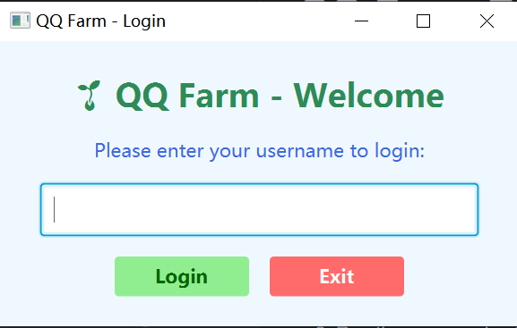
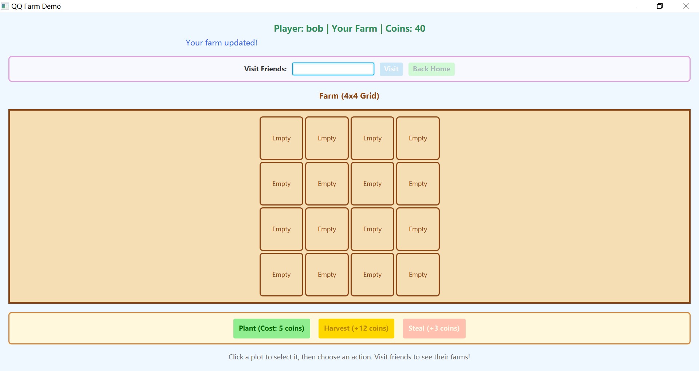
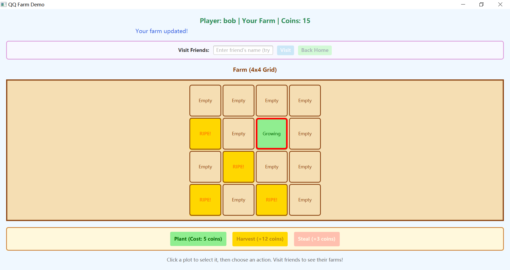
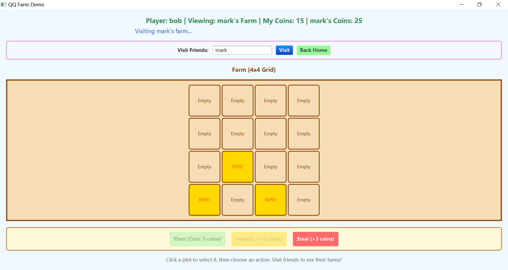
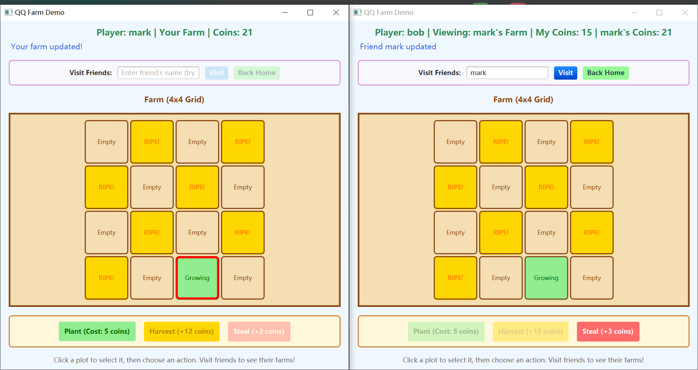
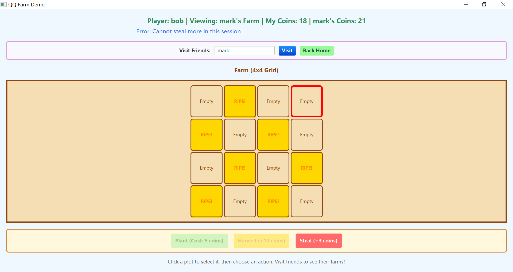
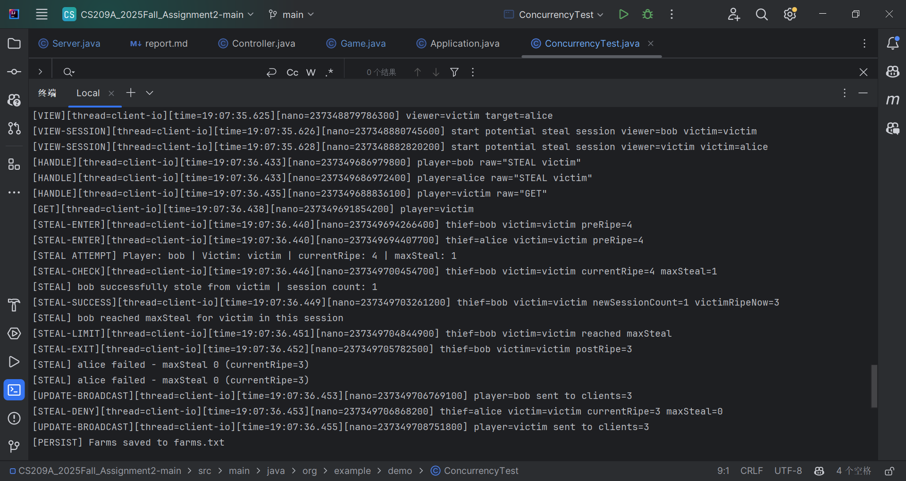
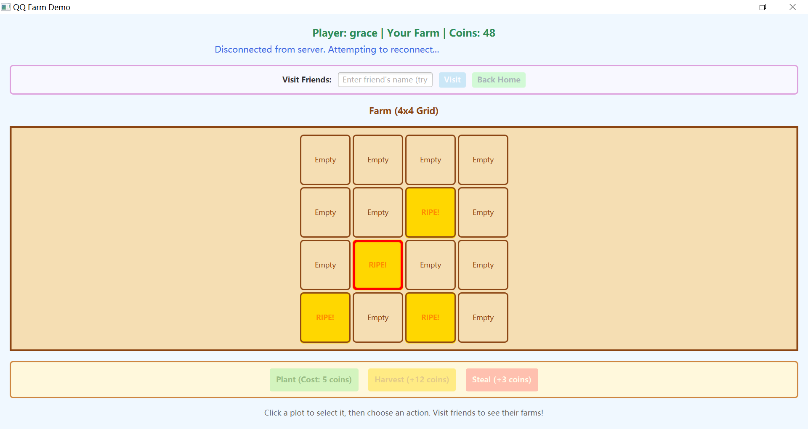

# QQ Farm Report
#### 12311043 魏宇晴

## 1. Overview
Instructions on to run the programme:
1. The environment of this project is JDK 22.
2. Open a terminal and navigate to the directory containing the source code.
3. Run the server using the command:
   ```
   mvn compile exec:java "-Dexec.mainClass=org.example.demo.server.Server"
   ```
   The server will start listening on **port 5050**.
   You should see:
    ```
    ========================================
    Server started on port: 5050
    Waiting for clients...
    ========================================
    ```
4. Right click → **Run 'Application.main()'**.
5. Firstly, you will see the following login window.

   
   
   Enter a username (e.g., `alice`, `bob`, `grace`). Click **Login** to proceed.
6. After logging in, you will see the main interface of the farm.
    
    You can see your current coins at the top left corner. Each player owns a 4x4 grid of plots (states: `EMPTY`, `GROWING`, `RIPE`). 
    
    - **Select a plot** by clicking on an empty cell (it will have a red border).
    - Click **Plant** (costs 5 coins).
      - The plot turns **green** (`GROWING`).
      - After **10 seconds**, it automatically becomes **gold** (`RIPE`).
    - Click **Harvest** to collect the crop.
      - You gain **+12 coins**.
      - The plot returns to `EMPTY`.
      
    
7. Type the name of the user you want to steal from in the text field at the top and click the "Visit" button to enter his/her farm.
    
    You can see your own coins and the coins of the user you are visiting at the top. You can also click the "Back Home" button on the top right corner to return to your own farm. 
    
    **Real-time synchronization:** If `mark` plants/harvests while you're viewing, you'll see the updates immediately.
    
    Click the "Steal" button at the bottom right corner to steal a random crop from that user's farm.  
    Stealing Rules:
      - **Victim must be "away"** (viewing another player's farm, not their own).
      - You can only steal **ripe crops** (`RIPE` state).
      - **25% limit:** You can steal at most `floor(currentRipe × 0.25)` crops per session.
          - Example: If victim has 8 ripe crops, you can steal **2 times** (floor(8×0.25)=2).
          - After stealing twice, the session ends. You can't steal again until the victim plants new crops.
      - **Each successful steal:**
          - Victim loses 1 ripe crop (it becomes `EMPTY`).
          - You gain **+3 coins**.
        
    
    On the above screenshot, you can see that the visitor successfully stole a mature crop from the victim's farm, and the visitor's coins increased accordingly. The server side response the following meassage:
    ```
    [VIEW] mark is viewing grace's farm
    [STEAL ATTEMPT] Player: bob | Victim: mark | currentRipe: 8 | maxSteal: 2
    [STEAL] bob successfully stole from mark | session count: 1
    [PERSIST] Farms saved to farms.txt
    [STEAL ATTEMPT] Player: bob | Victim: mark | currentRipe: 7 | maxSteal: 1
    [STEAL] bob failed - session limit reached, current: 1, max: 1
    ```
   
## 2. Key Implementations 
This part is written mainly to match the **Key Requirements** in the project description pdf.

### 2.1 Server-Side Implementation
The server manages all players, crop growth, and concurrent stealing requests. It ensures that updates to shared data (e.g., crop yield) are **atomic** and **thread-safe**.

#### Connection Management :
- **Multi-threaded Architecture**: Uses `CachedThreadPool` to spawn one thread per client connection.
- **ClientHandler**: Each connected client is handled by a dedicated `client-io` thread that processes incoming commands (LOGIN, PLANT, HARVEST, STEAL, etc.).
- **Thread Pool Configuration**:
  ```java
  private final ExecutorService pool = Executors.newCachedThreadPool((Runnable runnable) -> {
      Thread t = new Thread(runnable, "client-io");
      t.setDaemon(true);
      return t;
  });
  ```
#### Game State Management :
- Farm Object per Player: Each player's farm is stored in a `ConcurrentHashMap<String, Game>`.
- 4×4 Grid: Each `Game` object maintains a `PlotState[][] board` with 16 plots.
- Crop States: `EMPTY` (available for planting), `GROWING` (maturing), `RIPE` (ready to harvest).

#### Crop Growth Threads :
- Automatic Maturation: When a crop is planted, a `ScheduledExecutorService` schedules a task to change its state from `GROWING` to `RIPE` after 10 seconds.
- Background Timer: Each `Game` object has its own `crop-growth` thread:
  ```Java
    private final ScheduledExecutorService scheduler = Executors.newScheduledThreadPool(1, runnable -> {
    Thread thread = new Thread(runnable, "crop-growth");
    thread.setDaemon(true);
    return thread;
    });
  ```
- Timestamp-Based Recovery: When the server restarts, `GROWING` crops resume their countdown based on elapsed time (stored in `farms.txt`).

#### Atomic Operations : 
- Planting:
    - Synchronized Check: Before planting, the server verifies the plot is EMPTY and the player has sufficient coins:
    ```Java
    public void plant(int row, int col) {
        Consumer<Game> callback;
        long plantTime = System.currentTimeMillis();
        synchronized (this) {
            if (board[row][col] != PlotState.EMPTY) {
                throw new IllegalStateException("Plot occupied");
            }
            if (coins < PLANT_COST) {
                throw new IllegalStateException("Not enough coins");
            }
            coins -= PLANT_COST;
            board[row][col] = PlotState.GROWING;
            plantTimestamps[row][col] = plantTime;
            System.out.println(Thread.currentThread().getName() + " PLANT (" + row + "," + col + ") at " + plantTime);
            callback = onStateChange;
        }
        if (callback != null) callback.accept(this);
        // 10秒后成熟
        scheduleRipen(row, col, GROW_TIME_MS);
    }
    ```
- Harvesting:
    - Atomic Yield Collection: Only the owner can harvest RIPE crops. The operation is synchronized:
    ```Java
    public void harvest(int row, int col) {
        Consumer<Game> callback;
        synchronized (this) {
            if (board[row][col] != PlotState.RIPE) {
                throw new IllegalStateException("Crop not ripe");
            }
            board[row][col] = PlotState.EMPTY;
            plantTimestamps[row][col] = 0;
            coins += HARVEST_REWARD;
            System.out.println(Thread.currentThread().getName() + " HARVEST (" + row + "," + col + ")");
            callback = onStateChange;
        }
        if (callback != null) callback.accept(this);
    }
    ```
- Stealing:
The stealing logic is implemented on the server to ensure thread-safe and atomic operations, preventing race conditions and enforcing gameplay rules.

  - The `synchronized (victim)` block guarantees atomic access to the victim's farm for concurrent stealing requests. This prevents over-stealing by:
    - Ensuring that `currentRipe` and `maxSteal` are calculated based on the latest state.
    - Allowing only one thief to modify the victim's farm at a time.

  - Using a single lock (`synchronized (victim)`) is sufficient because:
    - Victim’s crop state is independent of thief’s coin state.
    - Thief’s coin balance update (`addCoins`) is handled internally with synchronized methods in the `Game` class, ensuring thread safety.
    
  ```Java
  private void handle(String line) {
        try { // ... other command handling ... 
             switch (cmd) { // ... 
                      case "STEAL": { // ...
                          synchronized (victim) {
                              int currentRipe = victim.getRipeCount();
                              int maxSteal = (int) (currentRipe * 0.25);
                              // ...
                              if (sessionCount >= maxSteal) {
                                  out.println("ERR Cannot steal more in this session");
                                  System.out.println("[STEAL] " + player + " failed - session limit reached, current: "
                                          + sessionCount + ", max: " + maxSteal);
                                  break;
                              }
                              boolean success = victim.stealOneRipe();
                              if (success) {
                                  thief.addCoins(Game.STEAL_REWARD);
                                  thiefSession.put(victimName, sessionCount + 1);
                                  out.println("OK " + snapshot(thief));
                                  System.out.println("[STEAL] " + player + " successfully stole from " + victimName
                                          + " | session count: " + (sessionCount + 1));
                                  if ((sessionCount + 1) >= maxSteal) {
                                      thiefCanSteal.put(victimName, false);
                                      System.out.println("[STEAL] " + player + " reached maxSteal for " + victimName + " in this session");
                                  }
                              } else {
                                  out.println("ERR No ripe crops to steal");
                                  System.out.println("[STEAL] " + player + " failed - no ripe crops in " + victimName + "'s farm");
                              }
                          }
                          // ...  
                      }
                      default:out.println("ERR Unknown command: " + cmd);
             }
        } catch (Exception e) {out.println("ERR " + e.getMessage());}
  }
  ```

### 2.2 Client & GUI Implementation
The client provides a JavaFX GUI for interacting with the farm. All network operations run on background threads to keep the UI responsive.

#### Core GUI Layout :
- 4×4 Grid: GridPane with ToggleButton cells representing plots.
- Visual States:
  - EMPTY: Beige background
  - GROWING: Green background
  - RIPE: Gold background, bold text
- Header Label: Displays player name, coins, and current view (own farm or friend's).
- Status Messages: Real-time feedback for actions (e.g., "Harvested successfully", "Steal failed").

#### Action Controls :
- Plant/Harvest/Steal Buttons: Enabled/disabled based on context (e.g., can't plant on friend's farm).
- Visit Friends: Switches the displayed grid to the friend's farm.
- Back Home: Returns to the player's own farm.

#### Visual Feedback :
- Crop states (`EMPTY`, `GROWING`, `RIPE`) are displayed visually with colors and text changes. This is described in the `updateCellState` method.
- Toast/status messages for various actions are displayed using `showStatus`.

```java
private void updateCellState(ToggleButton cell, int row, int col, boolean isSelected) {
    switch (state) { //...
        case EMPTY -> {
            text = "Empty";
            backgroundColor = "#F5DEB3";
            textColor = "#8B4513";
        }
        case GROWING -> {
            text = "Growing";
            backgroundColor = "#90EE90";
            textColor = "#006400";
        }
        case RIPE -> {
            text = "RIPE!";
            backgroundColor = "#FFD700";
            textColor = "#FF8C00";
        }
        default -> {
            text = "Empty";
            backgroundColor = "#F5DEB3";
            textColor = "#8B4513";
        }
    }
    cell.setText(text);
    cell.setStyle("-fx-background-color: " + backgroundColor); // ...
}
```

#### Networking & Updates :
- Asynchronous networking is handled by the `listenThread`. The thread listens for server updates and processes them accordingly. Push notifications from the server are handled in real-time.
  ```
  listenThread = new Thread(this::listenLoop, "server-listener");
  listenThread.setDaemon(true);
  listenThread.start();
  ```
- Push Notifications: Server broadcasts UPDATE <player> <snapshot> whenever a farm changes. Clients listening to that player's farm refresh their UI via `Platform.runLater()`.
- The network listener (`listenLoop` running within `listenThread`) processes server updates asynchronously and defers UI updates to `Platform.runLater()`. This allows the application to maintain responsiveness.
- Thread Safety: All UI updates must occur on the JavaFX Application Thread:
  ```
  Platform.runLater(() -> {
  updateGameSnapshot(myFarmGame, json);
  refreshBoardFromGameState();
  });
  ```

#### Responsiveness :
- No Blocking: Long-running tasks (network I/O, crop timers) stay off the JavaFX Application Thread.
- Timeline Ticker: A Timeline refreshes the grid every second to reflect state changes (e.g., GROWING → RIPE).
- The design moves all network-related tasks to the background thread (`listenThread`) and uses `Platform.runLater()` for safe UI updates on the JavaFX Application Thread. This ensures smooth interactions and non-blocking UI during network activity.
```java
private void listenLoop() {
    String line;
    try {
        while ((line = in.readLine()) != null) {
            final String msg = line;
            // ...
                Platform.runLater(() -> {
                    if (msg.startsWith("OK LOGGED_IN")) {
                        connected = true;
                        showStatus("Successfully connected to farm server!");
                        updateButtonStates();
                    } else if (msg.contains("{")) {
                        String json = msg.substring(3);
                        if (lastCommand.startsWith("STEAL")) {
                            updateGameSnapshot(myFarmGame, json);
                            updateCoinsDisplay();
                        } else if (lastCommand.startsWith("VIEW")) {
                            updateGameSnapshot(viewingFarmGame, json);
                            refreshBoardFromGameState();
                            updateCoinsDisplay();
                        } else if (lastCommand.startsWith("GET")) {
                            updateGameSnapshot(myFarmGame, json);
                            viewingFarmGame = myFarmGame;
                            viewingPlayerName = myPlayerName;
                            refreshBoardFromGameState();
                            updateCoinsDisplay();
                        } else if (lastCommand.startsWith("PLANT") || lastCommand.startsWith("HARVEST")) {
                            updateGameSnapshot(myFarmGame, json);
                            refreshBoardFromGameState();
                            updateCoinsDisplay();
                        } else {
                            if (viewingPlayerName.equals(myPlayerName)) {
                                updateGameSnapshot(myFarmGame, json);
                            } else {
                                updateGameSnapshot(viewingFarmGame, json);
                            }
                            refreshBoardFromGameState();
                            updateCoinsDisplay();
                        }
                    }
                    // ...
                });    
        }// ...
        Platform.runLater(this::onDisconnected);
    } catch (IOException e) {
        Platform.runLater(this::onDisconnected);
    }
}
```
### 2.3 Gameplay Rules

| **Action** | **Behavior**                                                                                       |
|-------|---------------------------------------------------------------------------------------------------|
| Plant | Costs 5 coins; plot becomes GROWING; matures to RIPE after 10 seconds                              |
| Harvest | Owner collects +12 coins when crop is RIPE; plot returns to EMPTY                                  |
| Steal | Allowed only when target crop is RIPE and owner is away; thief gets +3 coins; victim loses 1 crop; max floor(ripe × 0.25) steals per session |
| Visit Friends | Switches UI to display friend's farm; retains navigation back home                              |

### 2.4 Concurrency & Synchronization

#### Server-Side Locking
  - Synchronized Blocks: All critical sections (planting, harvesting, stealing) use `synchronized (this)` to prevent race conditions.
  - Victim-Only Lock: During stealing, only the victim's Game object is locked, avoiding deadlocks.

#### Threading Model

- Ensure background growth timers and network handlers do not block each other.

  Key Points:
  1. Crop maturation timers in `Game.scheduleRipen()` enter a synchronized block only for the brief state flip (`GROWING → RIPE`), minimizing lock duration.  
     → Growth tasks acquire a tiny lock just to update one plot and immediately release it.
  2. Network command handling runs in per-client `client-io` threads on the server. Each handler processes a request quickly and returns; it does not share locks with growth tasks except for brief per-farm (`Game`) synchronization. Different `Game` instances isolate contention.  
     → Command handlers and growth timers operate independently.
  3. Client-side UI updates use `Platform.runLater()` to marshal work back to the JavaFX Application Thread, preventing background listener threads from touching UI components directly.  
     → The UI thread remains responsive and never blocks on I/O or timers.
  4. Server statistics reporting and persistence (`saveFarmsToDisk()`) use separate executors, avoiding interference with real-time gameplay operations.  
     → Periodic tasks do not hold gameplay locks for long and never block connection handling.
  
  By combining very short synchronized sections, distinct executors (client I/O, crop growth, stats), and UI dispatch via `Platform.runLater()`, the design ensures growth timers, network handlers, and UI rendering do not block each other. This separation preserves responsiveness under concurrent activity.

- Document my threading model.

| Component / Location | Thread / Executor | Purpose | Concurrency Design Explanation |
|---------------------|-------------------|---------|--------------------------------|
| Server Client Connections (`Server.java`) | `ExecutorService` = `CachedThreadPool` (threads named `client-io`) | Handle each socket client's commands (LOGIN / PLANT / HARVEST / STEAL / VIEW) | One lightweight thread per active client; daemon threads avoid JVM hang on shutdown; short request handling keeps pool threads free; no blocking on crop timers. |
| Server Stats Monitor (`Server.java`) | `ScheduledExecutorService` (thread `stats-monitor`) | Periodically (every 60s) print uptime, player activity, farm summaries | Runs independently of game logic; read‑only access; does not lock farms except brief `g.getCoins()` calls — avoids contention with gameplay operations. |
| Per-Player Crop Growth (`Game.java`) | Per `Game`: `ScheduledExecutorService` (thread `crop-growth`) | Schedule maturation: change `GROWING → RIPE` after 10 seconds or remaining resumed time | Each task acquires `synchronized(Game.this)` briefly to flip a single plot; callback (`onStateChange`) invoked outside lock to minimize hold time and reduce contention among growth events. |
| Stealing Operation (`Server.java`) | Executes inside the thief’s `client-io` thread while holding `synchronized(victim)` | Atomically compute `currentRipe`, enforce `maxSteal`, remove one RIPE crop, reward thief | Single lock on victim avoids deadlocks (no nested victim→thief locking); thief coin update uses its own internal synchronization (`addCoins`) without expanding critical section. |
| Plant / Harvest (`Game.java`) | Caller’s `client-io` thread (`Server.java` command handler) enters `synchronized(this)` in `Game` | Modify one plot + coin balance atomically | Fine-grained lock per farm instance; no global locks; short critical sections prevent blocking other players’ operations. |
| Persistence Save / Load (`Server.java`) | Runs in calling `client-io` thread (save after state changes; load at startup) | Write/read all farm states to `farms.txt`; restore timers | Save uses `synchronized saveFarmsToDisk()` to serialize disk writes; each `Game.fromSaveString()` rebuild schedules with minimal locking; growth rescheduling avoids blocking active I/O threads. |
| Client Network Listener (`Controller.java`) | Background daemon thread `server-listener` | Continuously read server messages (UPDATE / OK / ERR) | I/O performed off JavaFX Application Thread; parses message, defers any UI mutation via `Platform.runLater()` ensuring thread-safe UI updates. |
| Client Auto-Reconnect Loop (`Controller.java`) | Background thread `reconnect-loop` | Attempt to re-establish socket (up to 10 tries) after disconnect | Isolated from UI; replaces streams atomically; on success schedules UI refresh via `Platform.runLater()`; prevents blocking main UI thread during reconnect sleeps. |
| Client Periodic UI Refresh (`Controller.java`) | JavaFX `Timeline` (1s interval) | Poll current `Game` state and refresh grid selection / styles | Lightweight repaint; avoids heavy logic; does not touch networking; safe because underlying state mutations already synchronized in `Game`. |
| Client User Actions (`Controller.java`) | JavaFX Application Thread (button handlers) | Capture user intent (Plant / Harvest / View / Steal / Back) and emit socket commands | Sends commands immediately; no long blocking; heavy operations (network read, maturation) delegated to background threads; prevents UI freeze. |
| Concurrency Demonstration (`ConcurrencyTest.java`) | Two Java threads (`steal-alice`, `steal-bob`) + main thread orchestrating | Simulate simultaneous STEAL requests to validate atomicity | Uses `CountDownLatch` to align send timing; server’s `synchronized(victim)` ensures serialized steal resolution; logs show second thief sees updated state. |
| Crop Maturation Resume (`Game.fromSaveString`) | Executes in server startup thread (`Server.start()`) | Reconstruct remaining growth timers after restart using timestamps | Computes elapsed time; schedules remaining delay tasks; only brief synchronized region per plot; avoids blocking acceptance of new client connections. |
| Broadcast Updates (`Server.broadcastUpdate`) | Caller’s `client-io` thread | Push `UPDATE <player> <snapshot>` to all connected clients | Iterates over `CopyOnWriteArrayList` of writers (safe under concurrent modifications); no locking on individual `Game` objects (snapshot already built). |
| UI Status / Coin Display (`Controller.java`) | JavaFX Application Thread via `Platform.runLater()` | Reflect latest state & user feedback (errors, success messages) | Ensures all label updates are marshaled to correct thread; prevents race conditions with background listener thread. |


#### Evidence of Correctness
  - `ConcurrencyTest.java` simulates two thieves (alice, bob) simultaneously stealing from victim (who has 4 ripe crops):
  - Both thieves send STEAL victim at the same time using CountDownLatch.
    Server logs show:
    
    - Results:
      - Victim's ripe count decreases correctly.
      - Each thief's coin balance increases appropriately.
      - No over-stealing occurs; maxSteal limits are enforced.

### 2.5 Exception Handling

#### Server Crashes :
Handle server crashes or disconnects gracefully with user notice.
- Client Detection: listenLoop catches IOException when server disconnects.
- User Notice: UI displays "Disconnected from server. Attempting to reconnect...". The buttons all become grey to indicate that they are unable to use.
- Auto-Reconnect: Client retries connection up to 10 times (3-second intervals).
- State Recovery: When server restarts, it loads farms.txt and restores all farm states (including GROWING timers).


#### User Input Validation :
Validate user inputs (e.g., cannot plant on occupied plot).
- Cannot Plant on Occupied Plot: Server checks if (board[row][col] != EMPTY) and returns ERR Plot occupied.
- Cannot Harvest Non-Ripe Crops: Throws IllegalStateException("Crop not ripe").
- Cannot Steal from Self: ensure(!victimName.equals(player), "Cannot steal yourself").

#### Network I/O Errors :
Catch network I/O errors without crashing the UI.
- Graceful Handling: All socket operations are wrapped in try-catch blocks.
- No UI Crashes: Exceptions are logged to console; UI remains functional and displays error messages.

## 3. Self-Check

### Thread Pools and Timers :
This part mainly talks about the Thread pools and timers, their configuration and how they avoid the deadlocks.

- Thread Pool Configuration:
  - `pool` for network operations.
    - **Pool**: Created using `Executors.newCachedThreadPool`, which scales dynamically depending on task demand.
    - **Thread Naming**: Threads have identifiable names like `client-io`, enabling debugging.
    - **Daemon Threads**: Set to daemon status so they don't block JVM from exiting.
  - `statsExecutor` for periodic tasks.
    - **StatsExecutor**: Created using `Executors.newScheduledThreadPool(1)`, designed for periodic tasks like server statistics monitoring.
    - **Single Thread**: Configured with one thread to ensure serialized task execution.
- Deadlock Prevention Strategy:
Ensure deadlock avoidance by using proper locking, thread isolation, and sequential resource access.
  - **Order of Locks**: Synchronization is applied to a single resource at a time, avoiding nested locks.
  - **Separate Tasks**: Long-running tasks are assigned to `pool`, preventing UI freeze or blocking the main thread.
- Platform.runLater for UI Updates:
All UI updates are safely submitted to the JavaFX Application Thread using `Platform.runLater`.
  - Ensures Thread Safety: Prevents UI updates from competing with background threads.
  - Keeps UI Responsive: Long tasks never directly interact with JavaFX Application Thread.

    
### Handling Unsent Actions During Crashes :
This part mainly explains how unsent actions are handled when the crash occurs.

- Persistent data (e.g., farm states and player coins) are saved to disk and reloaded during server restart.
```java
private synchronized void saveFarmsToDisk() {
    try (PrintWriter pw = new PrintWriter(new OutputStreamWriter(new FileOutputStream(SAVE_FILE),(StandardCharsets.UTF_8)))) {
        for (var entry : farms.entrySet()) {
            String name = entry.getKey();
            Game g = entry.getValue();
            pw.println(name + " " + g.toSaveString());
        }
        pw.flush();
        log("PERSIST", "saved file=" + SAVE_FILE + " farms=" + farms.size());
    } catch (IOException ex) {
        log("PERSIST-ERR", "error=" + ex.getMessage());
    }
}
```
- Ensures that game-critical data is not lost during abrupt crashes or interruptions.
```java
public synchronized void fromSaveString(String saveStr) {
    long now = System.currentTimeMillis(); // 当前时间
    for (int r = 0; r < ROWS; r++) {
        for (int c = 0; c < COLS; c++) {
            long timestamp = Long.parseLong(tokens[idx + 1].trim()); // 恢复存储的时间戳
            if (state == PlotState.GROWING && now - timestamp < GROW_TIME_MS) {
                scheduleRipen(r, c, remainingTime); // 未成熟则再次倒计时
            } else {
                board[r][c] = PlotState.RIPE; // 超时直接成熟
            }
        }
    }
}
```

### Evaluation Rubric :
This part summarizes which parts of the rubric the code has covered (server logic, client UI, concurrency, error handling).

| **Category**       | **Focus Areas**                                                                |
|---------------------|-------------------------------------------------------------------------------|
| **Server**          | Thread safety, state consistency, and protocol design.                       |
| **Client**          | Networking logic, responsiveness, and usability.                            |
| **GUI**             | Visual clarity, feedback cues, and interaction design.                       |
| **Concurrency**     | Race-condition handling and synchronized operations.                         |
| **Error Handling**  | Graceful recovery from client/server/network failures.                       |

#### Server:
- Implements synchronized access control for farm operations like planting and stealing to ensure thread safety.
- Persists farm states in `farms.txt` to guarantee state consistency across sessions.
- Designs the communication protocol (e.g., `LOGIN`, `STEAL`, `PLANT`, `GET`) for clear and reliable client-server interaction.

#### Client:
- Provides seamless reconnect logic (`startReconnectLoop`) for handling network disruptions.
- Ensures responsiveness with actions such as `STEAL`, `PLANT`, and `HARVEST` displaying immediate feedback even during network instability.
- Uses error prompts (e.g., "Disconnected from server") to enhance usability.

#### GUI:
- Designed with JavaFX for real-time UI updates and interactive feedback (e.g., plot selection).
- Displays game state (coins, crop status) dynamically for visual clarity.
- Uses animations (e.g., button color transition) to improve user experience.

#### Concurrency:
- Handles simultaneous operations from multiple clients (e.g., planting and stealing) using thread pools (`client-io`).
- Synchronizes shared resources via `synchronized` blocks (e.g., victim farm locking during steal actions).
- Ensures clean execution of scheduled tasks (e.g., crop ripening) without race conditions.

#### Error Handling:
- Catches network errors in `listenLoop` and gracefully handles client disconnections.
- Displays detailed error messages (e.g., unable to plant crops due to server downtime) directly on the UI.
- Reties queued operations upon reconnection, minimizing action loss.

### Discussion Points :

#### Data Consistency Guarantees 数据一致性保证 :
1. **Synchronized Farm States**: 
    - During operations (e.g., stealing, planting), synchronized blocks are applied to ensure only one thread can modify the farm state at a time. 使用同步块，确保一次只有一个线程可以修改农场状态
    - For example, `synchronized (victim)` in stealing logic prevents conflicting updates between multiple threads.

2. **Persistent Storage**:
    - Farm states (e.g., coins, plot status) are periodically saved to a file (`farms.txt`) using the `saveFarmsToDisk()` method in `Server.java`.
    - If the system crashes, data is reloaded using the `loadFarmsFromDisk()` method.

3. **Real-Time Synchronization**:
    - Client-side farm updates are immediately broadcasted to other players using the `broadcastUpdate()` method, ensuring consistent views across all players.


#### Thread Synchronization Choices 线程同步选择 :
1. **Synchronized Blocks**:
    - Applied to shared resources like farm states (e.g., `synchronized(victim)`).
    - Ensures thread safety without deadlocks as no nested locks are used.

2. **Thread Pools**:
    - Uses `client-io` thread pool for network-related operations (e.g., handling `STEAL` requests asynchronously).
    - `stats-monitor` thread pool handles periodic server monitoring tasks.

3. **Minimized Critical Sections**:
    - Ensures only critical parts of operations are synchronized, such as updating farm states during stealing.


#### System Extension Opportunities 系统扩展机会 :
1. **Global Leaderboard**:
    - Add a leaderboard displaying top players based on coins or overall farm productivity.

2. **Enhanced Farm Mechanics**:
    - Introduce new gameplay features like trading crops between players or collaborative farming.
    - Implement different crop types with varying growth times and rewards.
    - Use the coins earned to buy upgrades or decorations for the farm.
    - Besides growing plants, allow players to raise animals (e.g., chickens, cows) or go fishing that produce resources over time.

3. **Security Enhancements**:
    - Implement encryption or user authentication for secure client-server interactions.

4. **Real-Time Event Scheduling**:
    - Introduce special events (e.g., crop festivals or competitions) to improve engagement.


## 4. Architecture

## 5. Protocol Descriptions

